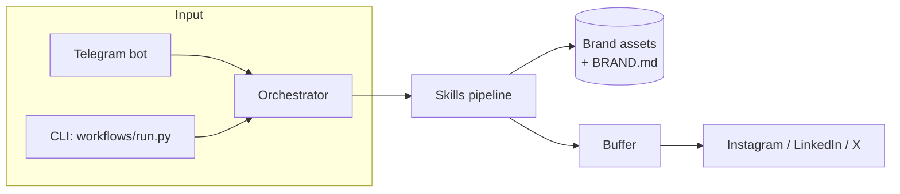

# Abra — Agent de Branding

**Turn the work you already did into a post you can approve.**

<br clear="left" />

Abra is a content capture and brand-management system for independent
experts, consultants, and founder-led operators who sell through trust. Give
it a call recording, a voice note, a rough draft, or a batch of photos, and
it comes back with reviewable, on-brand drafts for Instagram, LinkedIn, and
other channels — images and video included.

You stay in the loop: Abra drafts, adapts, and schedules; you review, edit,
and approve before anything goes out.

> [!NOTE]
> Abra can be self-hosted for full control and source access, or run through
> managed hosting when you'd rather not deal with infrastructure. Both paths
> lead to the same thing: real work turned into drafts you approve.

---

## Contents

- [Why Abra](#why-abra)
- [How it works](#how-it-works)
- [Architecture](#architecture)
- [Skills](#skills)
- [Getting started](#getting-started)
- [Running a workflow](#running-a-workflow)
- [Brand assets](#brand-assets)
- [Configuration](#configuration)
- [Documentation](#documentation)

---

## Why Abra

Most experts know they should post to stay visible, but turning a real
conversation into something publishable is a second job they don't have time
for. Abra removes the blank page:

- **Starts from something real** — a call, a voice note, a recording, a
  rough idea — never a blank prompt.
- **Keeps you in control** — every draft is reviewed and approved by you
  before publishing; nothing goes out unsupervised.
- **Sounds like you** — brand voice, tone, and visual identity are learned
  from your own material, not generic AI phrasing.
- **Attaches to work you already did** — posting becomes a byproduct of the
  work, not a separate creative ritual.

> [!TIP]
> The full product philosophy — brand personality, voice, and design
> principles — lives in [PRODUCT.md](./PRODUCT.md).

## How it works

Abra orchestrates a pipeline of small, single-purpose skills. Each skill
reads from an `input/` directory and writes to `output/`; the workflow
runner chains them so one skill's output becomes the next skill's input.

| Workflow | Input | Output |
|----------|-------|--------|
| `video-to-reel` | Video file(s) | Branded reel, scheduled to Instagram/LinkedIn |
| `image-to-post` | Photo(s) | Branded post with caption |
| `audio-to-post` | Voice or audio | Text post with transcript |
| `brand-enrichment` | Any content | Updated brand knowledge (`BRAND.md`) |

Every creative workflow runs `brand-manager` first (refresh brand knowledge)
and again near the end (adapt the draft to brand voice), then hands off to
`post-scheduler`, which queues the post to [Buffer](https://buffer.com).
Processed inputs are archived to `archive/<workflow>/<timestamp>/` after
scheduling.

See [WORKFLOW.md](./WORKFLOW.md) for the full step-by-step breakdown of each
workflow, and the Telegram conversation flow used in production.

## Architecture



Two ways to run it:

- **Self-hosted** — Docker container running OpenClaw or Hermes, with
  skills, brand assets, and inputs living on your own infrastructure. Full
  source access and control.
- **Managed** — a hosted [Vercel](https://vercel.com) dashboard
  (`platform/`) deploys and runs your own isolated Abra runtime on Azure
  AKS, backed by Firebase for auth and configuration. Convenience without
  giving up the review-before-publish model.

Both paths run the same skill pipeline underneath — managed hosting handles
infrastructure, updates, storage, and monitoring so you don't have to.

## Skills

Abra ships 31 modular skills, split into two groups. Each skill is an
independent `uv`-managed Python package: `uv sync` once, then
`uv run python scripts/<script>.py --input DIR --output DIR`, with
`--device cpu` as a fallback wherever a GPU model is involved.

<details>
<summary><strong>Creative & media skills</strong> (image, video, audio)</summary>

| Skill | Input | What it does | Min VRAM |
|-------|-------|--------------|----------|
| `photo-picker` | images | Score and pick the best photos | ~1 GB |
| `bokeh-effect` | images | Synthetic bokeh / portrait mode | ~1.5 GB |
| `background-remover` | images | Remove background, replace with colour/image | ~0.5 GB |
| `image-captioner` | images | Auto-describe and suggest captions | ~4 GB |
| `frame-interpolator` | videos | Frame interpolation (60fps / slow motion) | ~2 GB |
| `video-matte` | videos | Remove video background, composite backdrop | ~3 GB |
| `audio-splitter` | video/audio | Separate vocals from music | ~2 GB |
| `music-generator` | prompt / video | Generate brand background music | ~3 GB |
| `animate-image` | images | Image → animated video clip | ~8 GB |
| `video-generator` | prompt / images | Generate videos from text or images via Higgsfield | cloud |
| `video-editor` | video | Edit / inpaint video regions via prompt | ~8 GB |
| `media-analyzer` | images / videos | Analyze visual content with vision-language models | ~30 GB GPU |
| `giphy` | videos | Overlay animated GIF stickers from GIPHY with optional SFX | 0 GB |
| `freesound` | videos | Mix Freesound sound effects into videos with optional GIF overlays | 0 GB |
| `pixabay` | videos | Overlay royalty-free Pixabay images and video clips | 0 GB |
| `video-enhancer` | videos | Sharpen, colour grade, normalise audio | 0 GB |
| `video-captioner` | videos | Whisper transcription + animated caption burn-in | 0 GB |
| `remotion-video` | render spec / assets | Render one branded video with Remotion, MP4 + thumbnail + manifest | 0 GB |
| `visual-hook` | images/videos | Add bold hook text overlays in social-safe zones | 0 GB |
| `end-cta` | images/videos | Apply branded end-card CTAs and overlays | 0 GB |

Plus the core pipeline skills: `brand-manager`, `audio-transcriber`,
`video-cutter`, `image-generator`, `social-resizer`, `post-scheduler`,
`canva-connector`. `giphy`, `freesound`, and `pixabay` each need one API key
(`GIPHY_API_KEY`, `FREESOUND_API_KEY`, `PIXABAY_API_KEY`).

</details>

<details>
<summary><strong>Marketing & growth skills</strong> (require provider API keys)</summary>

| Skill | Location | What it does |
|-------|----------|---------------|
| `brand-strategist` | `brand-manager/` | Brand foundation, positioning, and identity development |
| `growth-strategist` | `brand-manager/` | Growth strategy, competitive analysis, and market positioning |
| `seo-researcher` | `brand-manager/` | SEO research, keyword analysis, and search optimization |
| `funnel-optimizer` | `brand-manager/` | Funnel analysis, conversion optimization, and user journey mapping |
| `email-campaigner` | root | Email marketing campaigns with Resend, Mailchimp, SendGrid, Kit |
| `ads-manager` | root | Paid advertising management for Google Ads campaigns |
| `revenue-manager` | root | CRM integration and revenue operations with HubSpot, Salesforce, Close |
| `social-analytics` | root | Social post analytics and performance reporting via SociaVault |

Provider keys and setup steps for each of these live in
[docs/SETUP.md](./docs/SETUP.md).

</details>

Full per-skill documentation, including GPU/CPU tradeoffs, is in
[SKILLS.md](./SKILLS.md).

## Getting started

### Prerequisites

- Docker
- Git (for submodule management)
- An OpenClaw-compatible base image, built from this repo's `Dockerfile`

### Install

Abra installs into either OpenClaw or Hermes. Set your API keys in a `.env`
file first — both installers read `./.env` by default (override with
`--env-file`), import the values, and warn about anything missing.

```bash
# OpenClaw install
docker build -t abra:latest .
docker compose up -d openclaw-gateway
bash ./installers/install-abra-on-openclaw.sh
# or: bash ./installers/install-abra-on-openclaw.sh --env-file ./.env.production

# Hermes install
bash ./installers/install-abra-on-hermes.sh
```

The OpenClaw installer copies Abra into `~/.openclaw/workspace-abra/` and
registers it with OpenClaw. The Hermes installer creates a dedicated
profile under `~/.hermes/profiles/abra/` with its own `.env`,
`config.yaml`, and skill set. Both installers can seed skill API keys
(Buffer, GIPHY, Freesound, Pixabay, and optional Backblaze B2 staging for
video uploads) into the target runtime config — see
[SKILLS.md](./SKILLS.md) and [docs/SETUP.md](./docs/SETUP.md) for details.

> [!IMPORTANT]
> `TELEGRAM_BOT_TOKEN` is never copied automatically from an existing
> Hermes or OpenClaw config — provide it via the shell, this repo's `.env`,
> or the interactive installer prompt.

## Running a workflow

```bash
cd workflows

# Video → branded reel
uv run python run.py --workflow video-to-reel --input ../video.mp4 \
  --channel-id CHANNEL_ID --due-at 2026-04-01T12:00:00Z

# Photo(s) → branded post
uv run python run.py --workflow image-to-post --input ../photos/ \
  --channel-id CHANNEL_ID

# Voice → text post
uv run python run.py --workflow audio-to-post --input ../voice.m4a \
  --channel-id CHANNEL_ID

# Add content to brand knowledge
uv run python run.py --workflow brand-enrichment --input ../article.md
```

| Flag | Description |
|------|-------------|
| `--input` | Input file or directory |
| `--output` | Output directory (default: `output/`) |
| `--channel-id` | Buffer channel ID — required for workflows that schedule posts |
| `--skip-optional` | Skip enhancement steps like music generation |
| `--device` | `auto`, `cpu`, or `cuda` |
| `--no-archive` | Don't archive input after scheduling |
| `--text`, `--mode`, `--due-at` | Override derived scheduler text, mode, or schedule time |
| `--image-url`, `--video-url`, `--video-staging-provider` | Override scheduler media and video staging |
| `--ig-type`, `--ig-first-comment`, `--li-first-comment`, `--link-attachment` | Platform-specific scheduler options |

> [!WARNING]
> `--channel-id` needs a real Buffer channel ID, not a platform label —
> `CLAW_DEFAULT_CHANNEL` alone isn't enough for scheduling.
> `video-to-reel` defaults to `--mode customScheduled --ig-type reel`, so
> local scheduled reels also need `--due-at`.

## Brand assets

`brand-manager` stores and serves the images, fonts, videos, and CTAs every
other skill draws on, under `skills/brand-manager/brand-assets/` and
indexed in `asset-manifest.json`:

```bash
# Store a brand image or font
python skills/brand-manager/scripts/brand_assets.py store-image --input ./logo.png --name main-logo --tags logo,primary
python skills/brand-manager/scripts/brand_assets.py store-font --input ./Inter-Bold.ttf --name inter-bold --tags heading

# List / locate assets
python skills/brand-manager/scripts/brand_assets.py list
python skills/brand-manager/scripts/brand_assets.py get-path --tag logo
```

Full asset commands (fonts from Fontsource/Google Fonts, video hooks, text
and image CTAs) and the manifest schema are documented in
[`skills/brand-manager/SKILL.md`](./skills/brand-manager/SKILL.md).

## Configuration

```bash
# Core
CLAW_BRAND_FILE=./BRAND.md         # Path to brand specification
CLAW_INPUT_DIR=./input/            # Raw input location
CLAW_OUTPUT_DIR=./output/          # Processed output location

# Scheduling
CLAW_BUFFER_DAYS=5                 # Default buffer days
BUFFER_API_KEY=your-buffer-token   # Required for scheduling

# Optional
CLAW_GDRIVE_ENABLED=true           # Enable Google Drive sync
```

Deeper integration details — Backblaze B2 video staging and per-skill
credential resolution order live in [SKILLS.md](./SKILLS.md); how the
managed platform (`platform/`) deploys onto Vercel/Firebase/AKS is
documented in [CLOUD.md](./CLOUD.md).

## Documentation

| Document | Description |
|----------|-------------|
| [PRODUCT.md](./PRODUCT.md) | Product purpose, users, brand personality, design principles |
| [SOUL.md](./SOUL.md) | Agent identity, persona, and behavior specification |
| [WORKFLOW.md](./WORKFLOW.md) | Complete processing workflow and Telegram conversation flow |
| [SKILLS.md](./SKILLS.md) | Detailed per-skill documentation, VRAM requirements, and CPU fallback |
| [docs/SETUP.md](./docs/SETUP.md) | Marketing skill API key setup and provider configuration |
| [CLOUD.md](./CLOUD.md) | Cloud topology for the managed platform (Vercel, Firebase, AKS) |
| [platform/](./platform/) | Managed hosting dashboard (Next.js) |
